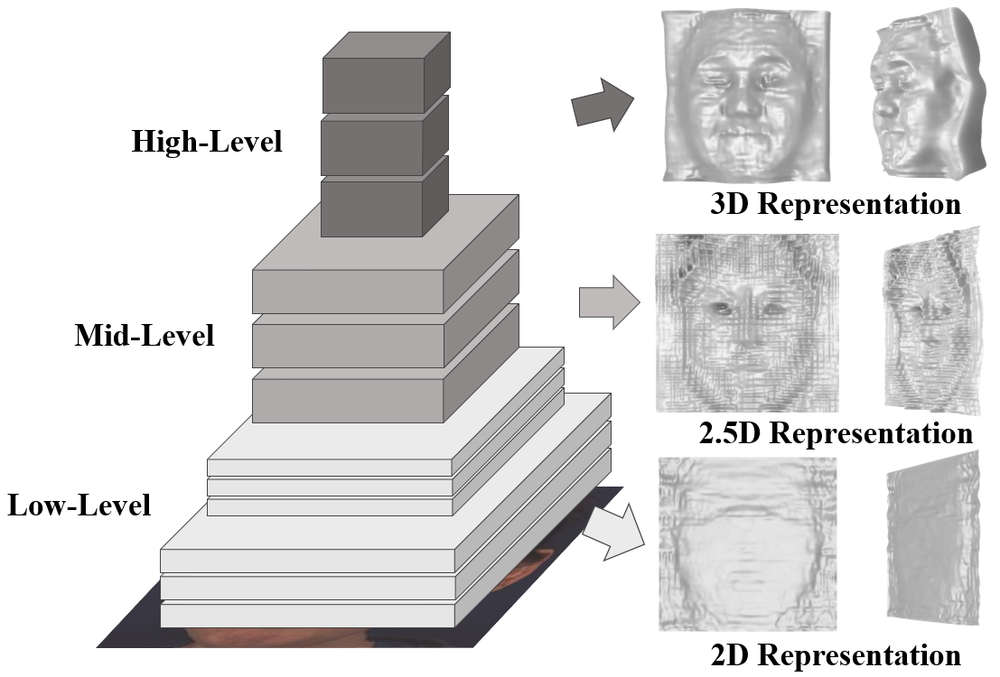
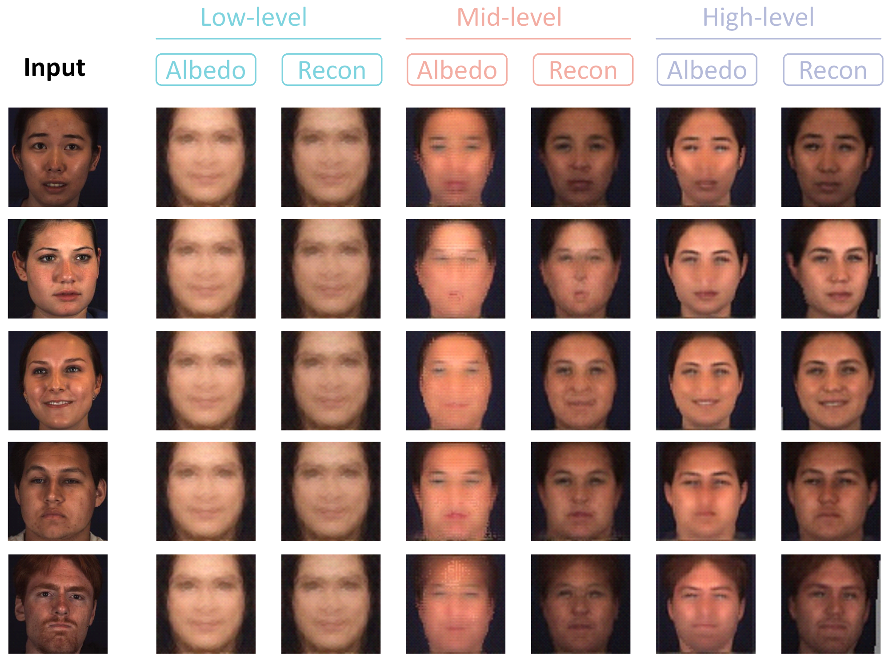
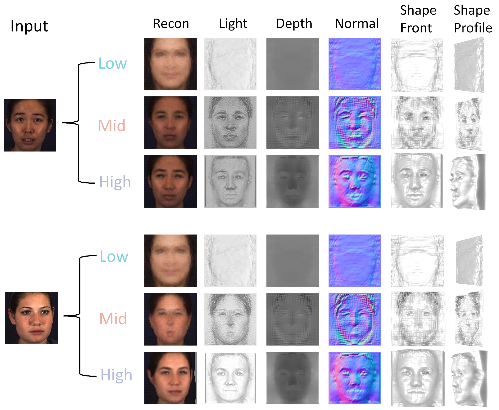

# Revisiting Marr in Face: The Building of 2D–2.5D–3D Representations in Deep Neural Networks

By [Xiangyu Zhu](https://xiangyuzhu-open.github.io/homepage/), [Chang Yu](), [Jiankuo Zhao](https://lcfaw.github.io/), [Zhaoxiang Zhang](), [Stan Z.Li]() and [Zhen Lei](http://www.cbsr.ia.ac.cn/users/zlei/).

This repository is the official implementation of [MarrFace](https://arxiv.org/abs/).



In this paper, we introduce graphics probe, a new approach that effectively converts a network’s intermediate feature
into visualizable computer graphics (CG) elements, including depth, albedo, camera view, and lighting. Our analysis
of the probed depth indicates that DNNs initially form 2D representations, then evolve to 2.5D representations that
capture surface normals with limited depth, and finally build 3D shapes. This sequential progression from 2D to 2.5D
to 3D is consistent with David Marr’s seminal theory of vision. 

## Getting Started

### Environment
Here, we provide commands that are needed to build the conda environment:
```bash
# Clone the repo:
git clone https://github.com/LCFAW/MarrFace.git
cd MarrFace

conda create -n marrface python=3.8.5
conda activate marrface

# conda install
conda install pytorch==1.11.0 torchvision==0.12.0 torchaudio==0.11.0 cudatoolkit=11.3 -c pytorch
# or: pip install torch==1.11.0+cu113 torchvision==0.12.0+cu113 torchaudio==0.11.0 --extra-index-url https://download.pytorch.org/whl/cu113

pip install -r requirements.txt

# install the neural_renderer 
pip install neural_renderer_pytorch
```  

### Data & Pretrained models

1. **prepare data**

Our experiments are performed on a combination of two datasets, each collected under different conditions: constrained
and unconstrained scenarios. The unconstrained dataset is the [CeleBA_cropped](https://mmlab.ie.cuhk.edu.hk/projects/CelebA.html). Considering the strong correlation between our research and view variations, we also introduce a dataset [BP4D-Spontaneous](https://www.cs.binghamton.edu/~lijun/Research/3DFE/3DFE_Analysis.html) that provides a more controlled environment with substantial pose variations, particularly in yaw angle.

2. **pretrained models**

The pretrained models are provided [here](https://drive.google.com/drive/folders/1r0mqvMkNLzi1e0gI-XBaqMN8dIzJWmqG?usp=drive_link).

### Demo

```bash
cd MarrFace
python demo.py
```

1. **Visulization**

We have prepared five samples in the dataset directory for testing. By running demo.py, you will find five directories in the results folder, each named after the corresponding sample ID. Each sample contains the following items:
* super_part/mid_part/sub_part: Includes the normal, depth and light of the high/mid/low-level representations.
* depth: Contains the complete depth data for each level. This data can be used to render shapes in Blender.
* normal: Contains the complete normal maps for each level.
* albedo: Includes the albedo and reconstruction results for each level.



**NOTE**: For sample F005__T7__0764_1_1 and F008__T2__0970_1_3, we also provide the rendering results in blender which we also use in the paper.



2. **Calculate Variatons**

By running the demo, you can also obtain variations in depth and z-axis normals across high, mid, and low levels. 

**NOTE:** The variations in the high- and mid- level representations are strongly influenced by the facial view. Since we only provide five frontal face samples for testing, the results may differ from those presented in the paper. For the low-level representations, the variations  remain nearly constant across samples, so the results are closely align with the paper.

## Citation
```
@article{Zhu2024marrface,
  title={Revisiting Marr in Face: The Building of 2D–2.5D–3D Representations in Deep Neural Networks},
  author={Xiangyu, Zhu and Chang, Yu and Jiankuo, Zhao and Zhaoxiang, Zhang and Stan, Z.Li and Zhen, Lei},
  journal={arXiv preprint arXiv:...},
  year={2024}
}
```

## Acknowledgements
There are some models or datasets in this implementation that are based on external sources. We thank the authors for their excellent works. Here are some great resources we benefit: [Swin-Transformer](https://github.com/microsoft/Swin-Transformer), 
[Neural 3D Mesh Renderer](https://github.com/daniilidis-group/neural_renderer), [CeleBA](https://mmlab.ie.cuhk.edu.hk/projects/CelebA.html), [BP4D](https://www.cs.binghamton.edu/~lijun/Research/3DFE/3DFE_Analysis.html).


