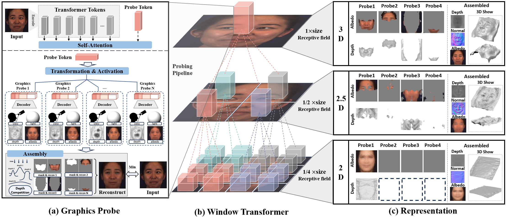

# Revisiting Marr in Face: The Building of 2D–2.5D–3D Representations in Deep Neural Networks

By [Xiangyu Zhu](https://xiangyuzhu-open.github.io/homepage/), [Chang Yu](), [Jiankuo Zhao](https://lcfaw.github.io/), [Zhaoxiang Zhang](), [Stan Z.Li]() and [Zhen Lei](http://www.cbsr.ia.ac.cn/users/zlei/).

This repository is the official implementation of [MarrFace](https://arxiv.org/abs/).


In this paper, we introduce graphics probe, a new approach that effectively converts a network’s intermediate feature
into visualizable computer graphics (CG) elements, including depth, albedo, camera view, and lighting. Our analysis
of the probed depth indicates that DNNs initially form 2D representations, then evolve to 2.5D representations that
capture surface normals with limited depth, and finally build 3D shapes. This sequential progression from 2D to 2.5D
to 3D is consistent with David Marr’s seminal theory of vision. 

## TODO
* Release the training code

## Getting Started

### Environment
Here, we provide commands that are needed to build the conda environment:
```bash
# Clone the repo:
git clone https://github.com/LCFAW/MarrFace.git
cd MarrFace

conda create -n marrface python=3.8.5
conda activate marrface

# conda install
conda install pytorch==1.11.0 torchvision==0.12.0 torchaudio==0.11.0 cudatoolkit=11.3 -c pytorch
# or: pip install torch==1.11.0+cu113 torchvision==0.12.0+cu113 torchaudio==0.11.0 --extra-index-url https://download.pytorch.org/whl/cu113

pip install -r requirements.txt

# install the neural_renderer 
git clone https://github.com/daniilidis-group/neural_renderer.git
cd neural_renderer
pip install neural_renderer_pytorch
```  

### Data & Pretrained models

1. **prepare data**

Our experiments are performed on a combination of two datasets, each collected under different conditions: constrained
and unconstrained scenarios. The unconstrained dataset is the [CeleBA_cropped](https://mmlab.ie.cuhk.edu.hk/projects/CelebA.html). Considering the strong correlation between our research and view variations, we also introduce a dataset [BP4D-Spontaneous](https://www.cs.binghamton.edu/~lijun/Research/3DFE/3DFE_Analysis.html) that provides a more controlled environment with substantial pose variations, particularly in yaw angle.

2. **pretrained models**

The pretrained models are provided [here](https://drive.google.com/drive/folders/1r0mqvMkNLzi1e0gI-XBaqMN8dIzJWmqG?usp=drive_link).

### Demo

```bash
cd MarrFace
python demo.py
```

1. **Visulization**

We prepare five samples in the dataset directory for testing. By runnig demo.py, you can see five directories named by the ID of the samples in the results directory. Every samples has the following items.
* super_part/mid_part/sub_part: including the normal, depth, light, shape_rot, and each probe's albedo calculated by the high/mid/low-level probes.
* depth: including each level's whole depth and depth_one_hot, six probe_depth in the high level, you can use the depth data to render the shape in blender.
* normal: including each level's whole normal.
* albedo: including each level's albedo and reconstrcution result, six probe_albedos in the high level.
* albedo_hot: including six albedo_masks in the high level.

NOTE: For sample F005__T7__0764_1_1 and F008__T2__0970_1_3, we also provide the rendering results in blender which we also use in the paper.



2. **Calculate Variatons**

By running the demo, you can also get the variations of depth and z-axis normal in high & mid & low level. Attention! Casuse the high & mid level 's varaitions are strong related to the view of the face and we only provide five frontal faces for testing, so the result is not the same to the paper! For low-level, its variations keep almost constant through each samples, so the results are similar to the paper. 

### Training


